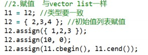
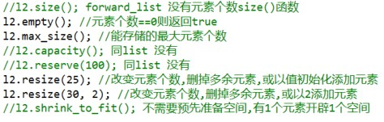
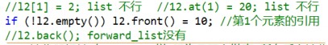
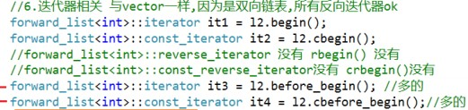
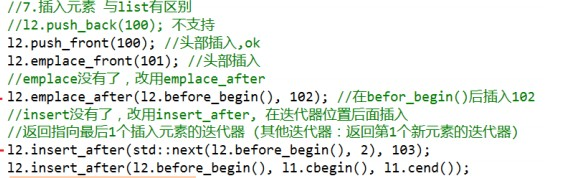
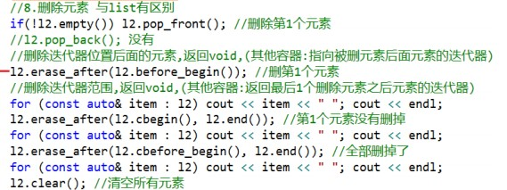

# forward_list 单向链表容器

[toc]

## 介绍

> - forward_list 单向链表：
>   - 不支持随机访问；
>   - 访问头部元素很快；
>   - 任何位置插入删除元素都很快，时间复杂度为 O(1);
>   - 插入和删除不会造成迭代器失效；
>   - 空间成本较高（有1个指针），比 list 双向链表节省；
>   - 与手写的C风格的单链表相比，没有任何时间和空间上的额外开销（比如没有 size).

```c++
template<class _Ty, class _Alloc = allocator<_Ty>> class forward_list
```

## 1. 初始化：和 vector、list 一样

1. 默认构造

```c++
forward_list<int> l1;
```

2. 值初始化构造

```c++
forward_list<string>l7(10);	
forward_list<string>l8(10,"aaa");		// 10 个元素，每个元素为 1
```

3. 初始化列表

```c++
forward_list<int> l2{1, 2, 3};
forward_list<double> l3 = {1.0,2.0,3.0};
```

4. 拷贝
   1. 传参拷贝
   2. 构造拷贝
   3. 移动构造
   4. 迭代器范围构造 : `可以使用其他容器，只要元素类型能转换（其他容器也一样）`

```C++
forward_ist<int>l4(l2);	// 传参拷贝
forward_list<int>l5 = l2; 	// 构造拷贝
forward_list<double>l6 = move(l3);	// 移动构造
forward_list<double>l6(l2.cbegin(), l2.cend());	// 迭代器范围构造
```

## 2. 赋值：与 vector、list一样



## 3. Swap : 与 vector 一样

## 4. 容量相关：不需要预先准备空间



## 5. 元素访问：`不能随机访问，头快、尾部和中间慢`



## 6. 迭代器相关：与 vector 一样，因为是双向链表，所有反向迭代器都 OK



## 7. 插入元素：与 list 有区别



## 8. 删除元素 ：与 list 有区别

