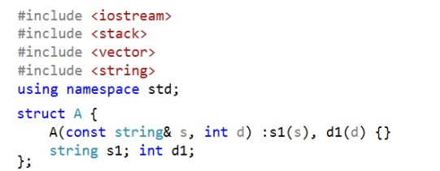
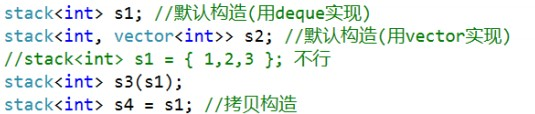
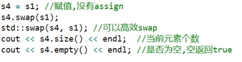
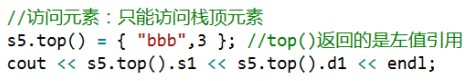
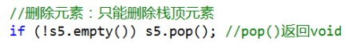

# stack 容器适配器

[toc]

## 介绍

> - stack 栈（FILO）：先进后出，默认是 deque 实现
> - 容器适配器
> - 头文件：#include<stack>

```c++
template<class _Ty, class _Container = deque<_Ty>> class stack;
```

# 开头代码部分



# main 主函数部分

## 1. 初始化



## 2. 赋值：没有 `assign`



## 3. 不支持迭代器，也没有 begin、end等迭代器操作

## 4. 插入元素：


## 5. 访问元素：只能访问栈顶元素



## 6. 删除元素：只能删除栈顶元素

