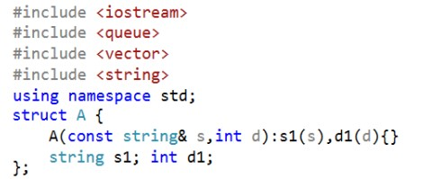
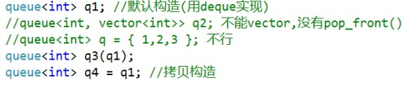
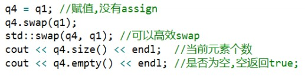
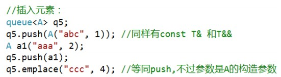
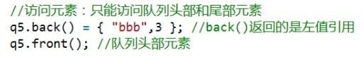

# queue 容器适配器

[toc]

## 介绍

>- queue 队列(FIFO) ：先进先出，默认是 deque 实现 容器适配器
>- 头文件：#include<queue>

```c++
template<class _Ty, class _Container = deque<_Ty>> class stack;
```


# 开头代码部分



# main 代码部分

## 1. 初始化



## 2.赋值



## 3. 不支持迭代器，也没有 begin、end等迭代器操作

## 4. 插入元素：



## 5. 访问元素：只能访问队列头部和尾部元素



## 6. 删除元素：只能删除队列头部元素

- `pop()`:删除队列头部元素

```C++
if（!q5.empty()) q5.pop();	// pop() 返回 void
```

