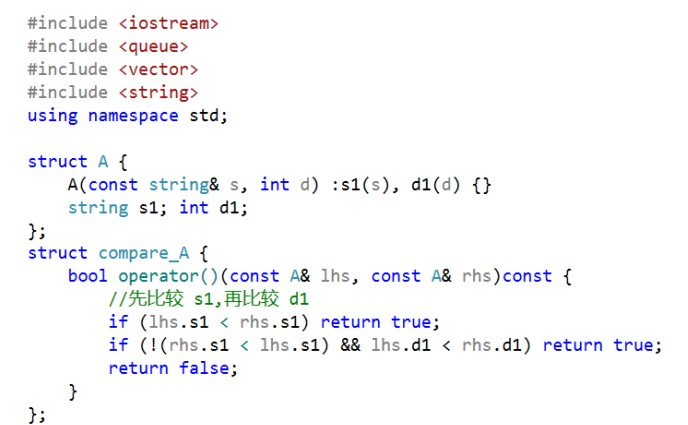
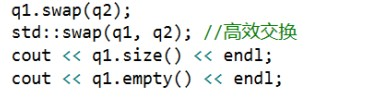
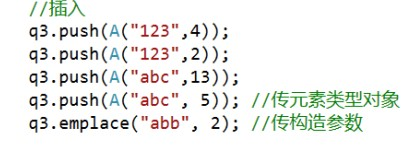

# priority_queue 容器适配器

[toc]

## 介绍

>- priority_queue 优先级队列（符合优先条件的先出），默认是 vector 实现 容器适配器
>- 头文件 ： #include<queue>

```c++
template<class _Ty, class _Container = vector<_Ty>, class _Pr = less<typename
    _Container::value_type>> class priority_queue;
```

# 开头代码部分



# main 函数部分

## 1. 初始化


## 2. Swap:



## 3. 不支持迭代器，也没有 begin、end 等迭代器操作

## 4. 比较运算：使用自定义的比较函数，要把三个模版参数都写出来

```C++
priority_queue<A, vector<A>, compare_A> q;
```

## 5. 插入元素：



## 6. 访问元素：只有 `top()`,没有 `front()、back()`

```c++
cout << q3.top().s1 << "--" << q3.top().d1 << endl;
```

## 7. 删除元素：

```c++
if(!q3.empty())	q3.pop();
```

